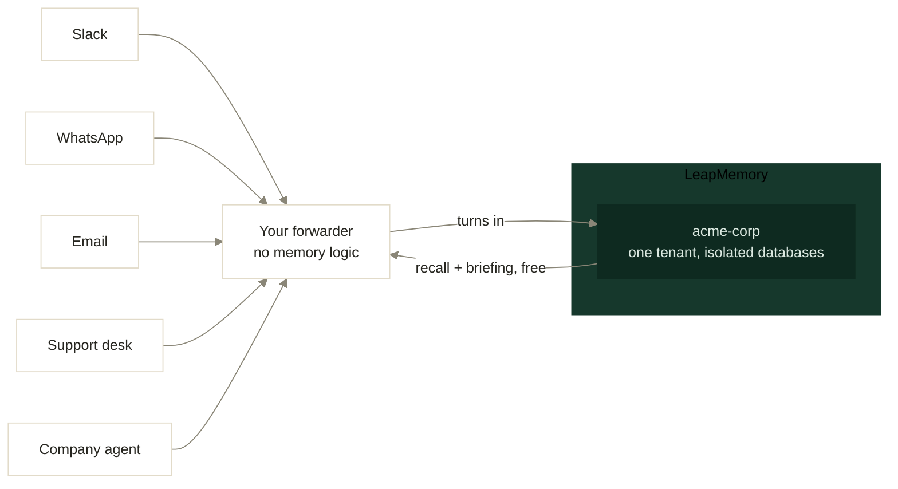
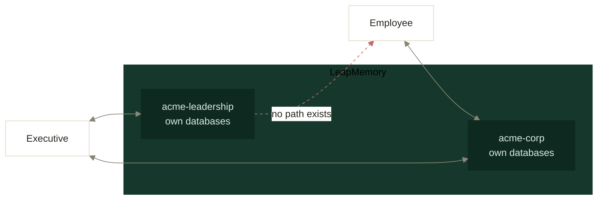

# lm-org-memory-demo

Give a whole company one shared memory. About 200 lines of forwarder code.

Every employee keeps talking to the tools they already use. The company
remembers all of it, knows who said what, and can brief a new hire on day one.

Built on [LeapMemory](https://leapmemory.com). Runs against the live API.

---

## Why this exists

The Claude API is stateless. So is every other LLM API. A company assistant
built on raw API calls forgets each conversation the moment it ends, and every
team that wants memory ends up building the same thing: storage, extraction,
retrieval, contradiction handling, attribution.

LM is that layer, already built. This repo is the smallest honest proof.

## Limits, before anything else

- The corpus here is **synthetic**. A fictional company, 30 turns, written by
  hand. It demonstrates the shape. It measures nothing.
- `measure.py` on this corpus reports about 1 memory per person per day,
  because that is how the corpus was written. Real usage rates are unknown
  until you run it on real forwarded traffic.
- No Slack or WhatsApp integration ships here. Real integrations need app
  approval, tokens, and webhooks, which would stall anyone cloning this. The
  forwarder is the pattern; wiring it is about a dozen lines, sketched below.
- Running this yourself costs about **$5**, the minimum credit top-up. Ingest
  is billed per memory. Recall and briefing are free.

## Quickstart

    git clone https://github.com/leapmemory/lm-org-memory-demo
    cd lm-org-memory-demo
    cp .env.example .env        # paste your API key from the dashboard
    python3 create_org.py       # one tenant = the whole company
    python3 import_history.py   # 30 turns of a fake company
    python3 ask.py "why did we choose postgres?"
    python3 brief.py
    python3 measure.py

No dependencies. Python 3 standard library only.

Ingest is asynchronous, so `import_history.py` polls until every turn is
indexed. Thirty turns take a few minutes.

## What comes back

`ask.py` returns the distilled facts, the original words, and who said them:

    Q: why did we choose postgres?

    what the company knows:
      - Postgres was chosen driven by the Meridian audit requirement.
      - Ridgeline database decision is Postgres.
      - Ridgeline is fully migrated to Postgres.

    who said it, word for word:
      [mike] Decision made. Ridgeline moves to Postgres. Main reason is the
             Meridian audit requirement, transactional audit tables are simple
             in Postgres and a nightmare in Mongo. I will write the migration
             plan.
      [agent] Noted. Ridgeline database decision: Postgres, driven by the
             Meridian audit requirement. Mike owns the migration plan.

Three months later nobody has to remember. The company does, in Mike's own
words.

`brief.py` returns the company's picture as one injectable block. Load it into
the system prompt when a session opens and a new hire's assistant already knows
the customers, the decisions, and the history.

## The files

| File | Job |
|---|---|
| `create_org.py` | One tenant for the company. Isolated databases, ready when the call returns. |
| `import_history.py` | Bulk import via `/turns/batch`, polls `/turns/status` until every turn is indexed. |
| `forward.py` | The pattern. Each message becomes a turn with a `speaker_id`. |
| `ask.py` | Recall: facts plus verbatim plus attribution. Free. |
| `brief.py` | The session-start briefing. Free. |
| `measure.py` | Memories per person per day, and what that costs. |
| `corpus/ridgeline_30.jsonl` | The synthetic company. Sarah in sales, Mike in engineering, Emily in support. |

## Wiring it to real channels

Your integration is a thin forwarder. Whatever the team already talks through,
forward each message as a turn:

    POST /v1/tenants/acme-corp/turns
    {"role": "user", "speaker_id": "mert", "content": "<the message>"}

`speaker_id` is the whole trick. It is what makes "who decided this, and why"
answerable later.

At session start, pull the briefing once. Per question, call recall. No memory
logic lives in your code.

## Key hygiene

Three keys, three jobs:

    admin   -> server only, tenant management
    ingest  -> the service saving turns, nothing else
    recall  -> read only, safe for the answering service

A leaked recall key cannot write or delete. Scope violations return
`403 scope_denied`.

## Memory hierarchy

One tenant per company is the default. When some knowledge should not reach
everyone, use more tenants. People write into the tenants they belong to, and
each assistant loads only the briefings its user is entitled to.

The separation is physical. Each tenant has its own databases, so there is no
query path from one to the other and no filter to get wrong. A recall key
scoped to `acme-corp` returns `403 scope_denied` against `acme-leadership`.

Trade-offs, stated plainly: the graphs do not cross-link, and a turn forwarded
to two tenants is billed twice.

## What this repo does not do

- No self-serve org signup. Today an org runs through a developer account.
- No visibility scopes inside a single tenant. Use separate tenants.
- No real channel integrations, by choice. See above.

## Docs

[leapmemory.com/docs](https://leapmemory.com/docs)

## License

MIT